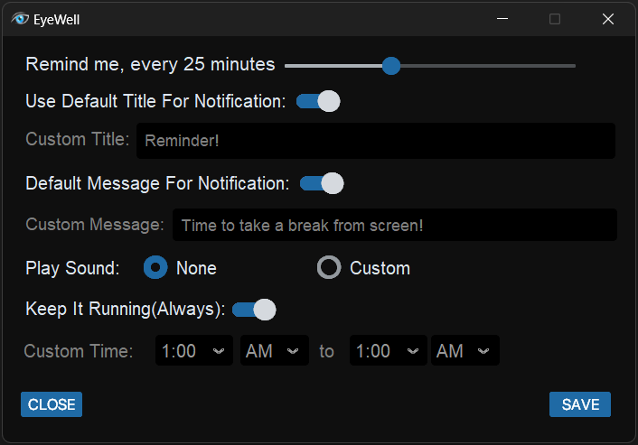

# EyeWell

**EyeWell** is an application which provides Custom Reminder Notification to help your eyes stay Nourish from screen!

## User Interface

---
## Features

- Set reminders with personalized titles and delay intervals.
- Adjust notification settings to suit your specific needs in reminders for notification.
- Add Custom Notification Audio to your reminders!
- Preview the audio before saving the reminder to ensure it’s perfect.
- Adjust and balance the volume according to your needs!.
### User-Friendly Interface
- Pretty Simple and modern UI according to your needs

---
## Installation
- Just Download and run the Executable file and you're done :)

### Steps to Install
#### Standard Installar  
- **Download** the Installation File from [EyeWell v0.1.1 Quick Setup](https://github.com/nothig007/EyeWell/releases/tag/v0.1.1-main-Installer) (recommended)
- Run the Installer and follow on screen instruction!
- Launch the app
#### Portable Installer
 - **Download** the application from the [EyeWell v0.1.1 Portable Installer](https://github.com/nothig007/EyeWell/releases/tag/v0.1.1-main-Portable-Installer)
 - Run the Executable File and enjoy.

---

## Troubleshooting
- if you found any bug, raise ur concern in Issues Tab
---

## License
EyeWell is licensed under the [MIT License](LICENSE). Feel free to use, modify, and distribute the application within the terms of the license.  
**Just give me credit for any usage of this project!**

---
## Contributing
To contribute:
- Fork the repository.
- Create a new branch for your feature or bug fix.
- Submit a pull request for review.
---
### Support
Contact me:
[shubhistrue@gmail.com](mailto:shubhistrue@gmail.com)

---

## Acknowledgments
- whole project is created by me from scratch

---
